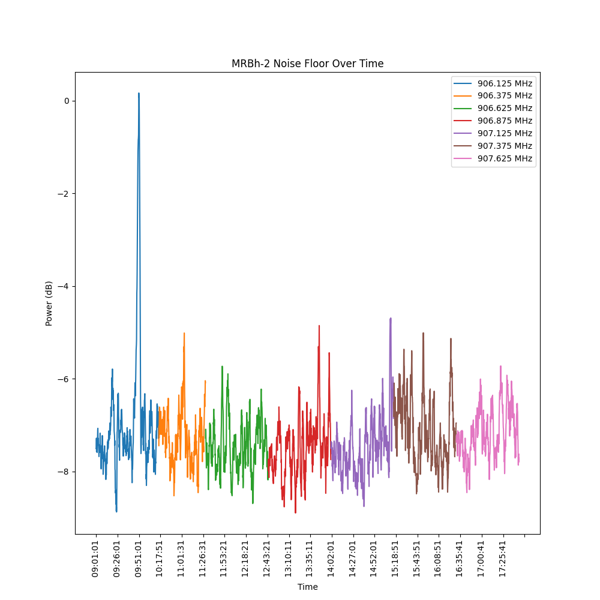

# Noise Floor Measurements

This procedure describes how to capture noise floor measurements using an RTL-SDR v4 dongle.  I'm sure other dongles can be used similarly as long as they share the same RTL2832 chip.

## Setup

### Mac

```sh
brew install librtlsdr
```

### Windows

I'm not a Windows user.  Help is much appreciated here, however I'm hopeful that the Windows Subsystem for Linux makes the rest of this guide straightforward to follow after initial installation of `librtlsdr`.

### Linux

```sh
sudo apt install librtlsdr2
```

## Capturing Data

```sh
mkdir location/<stationname>
cd location/<stationname>
../../measure.sh
```

### Explanation
According to the [modem presets](https://meshtastic.org/docs/overview/radio-settings/#presets), the bandwidth for Medium Fast is 250 kHz.  We also know that the default slot 20 is ***centered*** on 906.875 MHz with the signal extending 125 kHz on both sides.

To start, we'll capture the 3 slots above, below and including the default slot 20.  We'll capture readings from slot 20 as a form of a control, as we generally understand how busy that center frequency is supposed to be.

| Slot | Center Frequency (MHz) |
| ------ | ----------------- |
| 17 | 906.125 |
| 18 | 906.375 |
| 19 | 906.625 |
| 20 | 906.875 |
| 21 | 907.125 |
| 22 | 907.375 |
| 23 | 907.625 |

The output created by rtl_power has the format: `date, time, Hz low, Hz high, Hz step, samples, dbm, dbm, ...`

```sh
rtl_power -f 906000k:906250k:250k -i 10s -e 5m output.csv
```

Explanation:
* `-f 906000k:906250k:250k` specifies the frequency range from 906 MHz to 906.250 MHz with a 250 kHz maximum step.
* `-i 10s` sets the integration interval to 10 seconds.  This is how long of an interval over which the collected data will be averaged to produce a single number.
* `-e 5m` sets the total duration of data collection to 5 minutes.
* `output.csv` is the file where the results will be saved.

Note that the actual step (bin) size is calculated at runtime and is not exactly as you specify it in the command above @ 250 kHz.  The example command above generates steps (bins) that are 125 kHz.  There's some logarithmic math involved in [the calculations](https://github.com/keenerd/rtl-sdr/blob/master/src/rtl_power.c) that make it rather challenging to coerce it to choose a value that exactly matches what was specified.  The end result, is that in order to ensure that we're associating measurements with the correct frequency, we'll analyze a single "slot" at a time, even though the `rtl_power` tool is capable of scanning continuous frequency ranges.  It is just easier to be confident in the results this way since we are choosing between concrete channels that are adjacent to each other.

## Analyze the Captured Data

```sh
mkvirtualenv -p `which python3` noise-floor
pip install -U -r requirements.txt
./analyze.py
```

## Results by Location

### MRBh-2

#### Noise Floor



#### Location

[The Woods of Brushy Creek](https://maps.app.goo.gl/bXYvsAREVTngLnMX9)

#### Antenna Used

[Rokland 5.8 dBi fiberglass outdoor antenna](https://store.rokland.com/products/5-8-dbi-n-male-omni-outdoor-915-mhz-antenna-large-profile-32-height-for-helium-rak-miner-2-nebra-indoor-bobcat?variant=39392551895123) about 10' off the ground.


